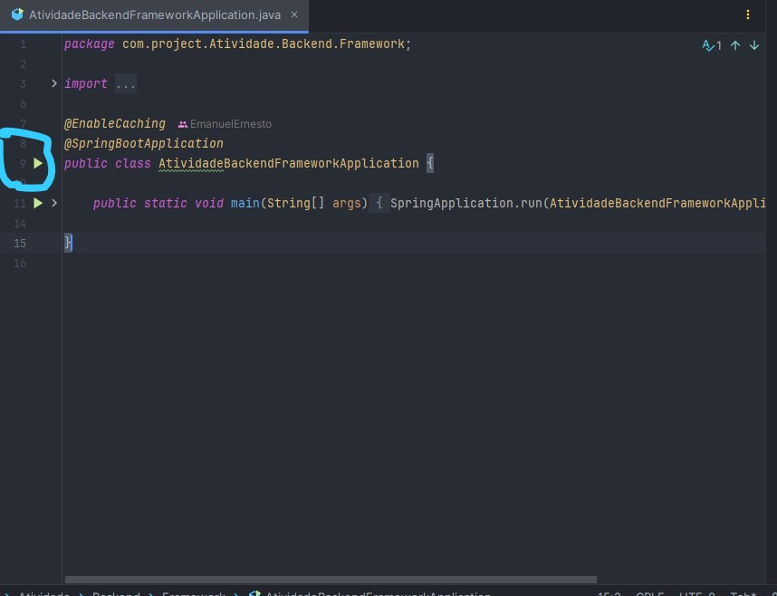

<h1 align="center">Atividade Backend Framework</h1>

Este projeto consiste em uma API desenvolvida como requisito para pontuação na disciplina de backend framework

# Participantes

- Emanuel Ernesto de Andrade Rêgo - 01614951
- Wesley Ruan de Lima Silva - 01555915
- Felipe Farias Galvão - 01608490


## Pré-requisitos

Antes de começar, verifique se sua máquina possui os seguintes requisitos:

- **Jdk**: versão 17 ou superior. Se você ainda possui a JDK instalada, siga o tutorial de instalação [aqui](https://techexpert.tips/pt-br/windows-pt-br/instalar-java-jdk-no-windows/).

- **Docker**: necessário para executar tanto o MySQL quanto o Redis localmente. Instruções de instalação estão disponíveis [aqui](https://docs.docker.com/get-docker/).

- **Git**: essencial para clonar o repositório. Baixe-o [aqui](https://www.git-scm.com/downloads).

- **Intellij**: IDE para melhor visualização do código e execução mais simplificada. Caso ainda não possua, Baixe a versão community (gratuita) [aqui](https://www.jetbrains.com/idea/download/?section=windows)

## Instalação e Configuração

1. **Clone o repositório**:

   ```bash
   git clone https://github.com/EmanuelErnesto/atividade-backend-framework.git


2. **Navegue Até a pasta do projeto**

  ```bash
  cd atividade-backend-framework

  ```


3. **Configuração do ambiente**


  ```bash
  cp .env.example .env
  ```


⚠️ Certifique-se que a porta `8080` esteja livre para o correto funcionamento da API.

<h1>🔧 Executando a API</h1>

**Para iniciar a API, acesse o Intellij, navegue até o arquivo **

Ou acesse o intellij e navegue o arquivo que se encontra em: 

"src\main\java\com\project\Atividade\Backend\Framework\AtividadeBackendFrameworkApplication.java". Na IDE, irá aparecer uma caixa de texto na tela pedindo para fazer o setup da versão do Jdk. Você deverá inserir ou a versão 17 ou superior.

Após isto, você deverá acessar o docker desktop (caso esteja no windows), após isto acessar o terminal e rodar o comando:

```bash
docker-compose up -d
```

Feito isto, o docker irá subir os contêineres necessários para rodar a aplicação. 

Com tudo isto feito, na IDE acesse o arquivo em AtividadeBackendFrameworkApplication.java e clique no botão indicado no print abaixo.



Feito isto, você poderá acessar a aplicação.

Para visualizar as rotas e a documentação (swagger) da API, acesse:

http://localhost:8080/swagger-ui/index.html#/

<h1>🪢Testes</h1>

Em desenvolvimento.

<h1>Tecnologias utilizadas</h1>

- Java/Springboot
- MySQL como banco de dados
- Documentação com swagger.
- Validação dos dados da requisição com o Bean Validation
- Caching com Redis
